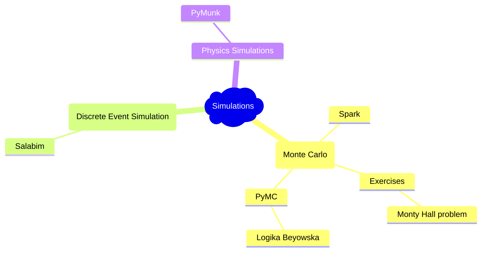

# Simulations

```mermaid
mindmap
    )Simulations(
        (Monte Carlo)
            Spark
            Exercises
                Monty Hall problem
            PyMC
                Logika Beyowska
        (Discrete Event Simulation)
            Salabim
        Physics Simulations
            PyMunk
```
